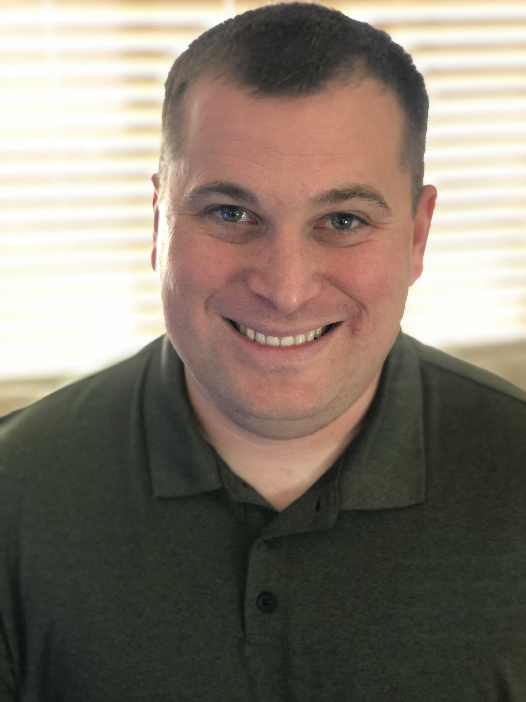

# Aside

{width="80%"}

<!-- `) -->

United States Army, Data Science (R1J) qualified Operations Research System Analyst, serving as a data scientist in the NETCOM - Data Science Directorate.

## Contact Info {#contact}

-   <i class="fa fa-envelope"></i> [evan.l.munson\@gmail.com](mailto:evan.l.munson@gmail.com){.email}
-   <i class="fa fa-github"></i> [github.com/evan-l-munson](https://github.com/evan-l-munson)
-   <i class="fa fa-gitlab"></i> [gitlab.devforce.disa.mil/emunson](https://gitlab.devforce.disa.mil/emunson)
-   <i class="fa fa-linkedin"></i> [inkedin.com/in/evan-munson-50033b61/](https://inkedin.com/in/evan-munson-50033b61/)
-   <i class="fa fa-phone"></i> +1 520 454 7144

## Skills {#skills}

-   -Experienced in R and RStudio with emphasis on the Tidyverse.
-   -Experienced in communicating to scientific and general public.
-   -Shiny applications
-   -Package development
-   -Github and GitLab
-   -Microsoft Office Tools

## Disclaimer {#disclaimer}

<!--This resume was made with the R package [**pagedown**](https://github.com/rstudio/pagedown).-->

Last updated on `r Sys.Date()`.

# Main

## Evan L. Munson {#title}

### Operations Research System Analyst, Data Science

## Education {data-icon="graduation-cap" data-concise="true"}

### Air Force Institute of Technology

M.S in Operations Research

Dayton, OH

2016--2018

Thesis: Sentiment Analysis of Twitter Data.

### Missouri University of Science and Technology

M.S. in Engineering management

Rolla, MO

2011--2012

### The University of Arizona

B.S. in Civil Engineering

Tucson, AZ

2001--2006

## Work Experience {data-icon="toolbox"}

### Data Scientist

Network Enterprise Technology Command

Fort Huachuca, AZ

2018--Present

-   Data Science (R1J) qualified Operations Research System Analyst, serving as a data scientist in the NETCOM - Data Science Directorate.
-   Responsible for multiple data science efforts, including predictive, prescriptive, and statistical modeling.
-   Developed multiple R packages and Shiny applications.

### Engineer Planner

US Army Special Operations Command

Fort Bragg, NC

2015--2016

-   Deputy Chief of Staff Construction Officer for the United States Army Special Operations Command (USASOC) that generates and sustains Army Special Operations Forces to conduct worldwide Special Operations.
-   Responsible for the knowledge management of over 80GBs of organizational digital files on both unclassified and classified systems. 
-   Responsible for the development and implementation of a new set of digital SOPs to govern the engineer sections digital files

### Company Commander

100th Engineer Company (Topographic)

Fort Bragg, NC

2014--2015

-   Responsibility to provide Geospatial Information and Services (GI&S) to strategic, operational, tactical and JIIM organizations.
-   Plans, coordinates and executes both technical and tactical training for 118 Soldiers, NCOs and Officers.
-   Recognized as being within the top seven of thirty leaders in the same peer group.

### Assistant Operations Officer

27th Engineer Battalion (C)(A)

Fort Bragg, NC

2014

-   Battalion Assistant Operations Officer for a Global Response Force, Combat Airborne Engineer Battalion of over 900 Soldiers.
-   Prepares detailed plans which support execution of training events and assigned battalion missions. 
-   Oversees Battalion level training meetings and coordinates directly with seven subordinate level commanders to ensure all training requirements are met.

### Real Property Manager

133rd Construction Management Team

Fort Bragg, NC / Afghanistan

-   Real Property Officer and Facilities/Contract Construction Management Engineer (FCCME) for a 4,500 Soldier functional engineer brigade capable of deploying anywhere in the world within 96 hours to support XVIII Airborne Corps contingency missions or other Unified Commands requirements.
-   Deployed in support of Operation Enduring Freedom (Afghanistan) and planned the de-construction of ~150 bases with the CENTCOM Material Recovery Element (CMRE) to ensure the responsible retrograde of US forces from Afghanistan.

### Battalion Operations Officer

1-68 AR

Fort Carson, CO / Iraq

-   Battalion Engineer, Force Protection Officer and Linguist Manager for a Combined Arms Battalion of over 900 authorized armor, infantry, engineer and support Soldiers. 
-   Responsible for the coordination and planning of all engineer related tasks and operations in Basra Province. 
-   Responsible for coordination and synchronization with subordinate companies and Brigade Headquarters for all engineer related tasks and missions.

### Company Executive Offiver

E. Co 1-68 AR

Fort Carson, CO / Iraq

-   Executive Officer of a 102 Soldier Combat Engineering Company deployed to Operation Iraqi Freedom 10; coordinates all mobility, countermobility, survivability and general engineering support for Battalion Task Force 1-68.
-   Responsible for managing and tracking the company's operations, training, supply, CBRN and arms room; coordinates all longs and short range training requirements and resources; assists in planning and executing company deployments and redeployments.

## Selected Teaching Experience {data-icon="chalkboard-teacher"}

### Biostatistics using R

Tufts University

Medford, MA

2016--2018

<!--::: concise-->

-   Created companion [recitation section](https://github.com/Aariq/biotstatistics-recitation-2018) to Biostatistics course to teach introductory R with a focus on the Tidyverse <!--:::-->

### Reproducible Workflows for Ecology Research

Workshop presented at Tufts University

Medford, MA

Oct 2018

-   Developed [workshop](https://github.com/Aariq/Reproducibility-ERGO) for ecologists including use of R projects, project organization, authoring R packages, GitHub, and data archiving

### R Notebooks: Richly annotate your statistical analyses and produce dynamic reports

Workshop presented at Tufts University

Medford, MA

Jan 2018

-   Demonstrated uses of R Notebooks for biological research
-   Discussed value of readable, annotated code for reproducibility and collaboration

## Selected Presentations {data-icon="comment-alt"}

### Multivariate Statistics for Ecology and Baked Goods

First place winning talk for the Tufts Graduate Student Symposium.

Medford, MA

March 2019

**ER Scott**

### Can pests rescue tea quality from climate change?

First place winning talk for Entomological Society of America Joint Meeting, Plant-Insect Ecosystems student competition

Vancouver, BC

Nov 2018

**ER Scott**, CM Orians

### Generating and analyzing metabolomic data from tea plant volatiles

Poster for Data Intensive Studies Center (DISC) Symposium at Tufts University

Medford, MA

Aug 2017

**ER Scott**, N Kfoury

## Selected Publications {data-icon="file"}

### Combined impacts of prolonged drought and warming on plant size and foliar chemistry

Ann. Bot. (2019). <doi:10.1093/aob/mcz004>

N/A

2019

CM Orians, R Schweiger, J Dukes, **ER Scott**, C Müller

### Interactive effects of drought severity and simulated herbivory on tea (Camellia sinensis) volatile and non-volatile metabolites

Environ. Exp. Bot. 157, 283--292 (2019). <doi:10.1016/j.envexpbot.2018.10.025>

N/A

2019

**ER Scott**, X Li, N Kfoury, J Morimoto, WY Han, S Ahmed, SB Cash, TS Griffin, JR Stepp, A Robbat, CM Orians

### Striking changes in tea metabolites due to elevational effects

Food Chem. 264, 334--341 (2018). <doi:10.1007/978-981-13-2140-5>

N/A

2018

N Kfoury, J Morimoto, A Kern, **ER Scott**, CM Orians, S Ahmed, TS Griffin, SB Cash, JR Stepp, D-Y Xue, C-L Long, A Robbat

### Direct Contact Sorptive Extraction: A Robust Method for Sampling Plant Volatiles in the Field

J. Agric. Food Chem. 65, 8501--8509 (2017). <doi:10.1016/j.foodchem.2018.05.040>

N/A

2017

N Kfoury, **ER Scott**, CM Orians, A Robbat
